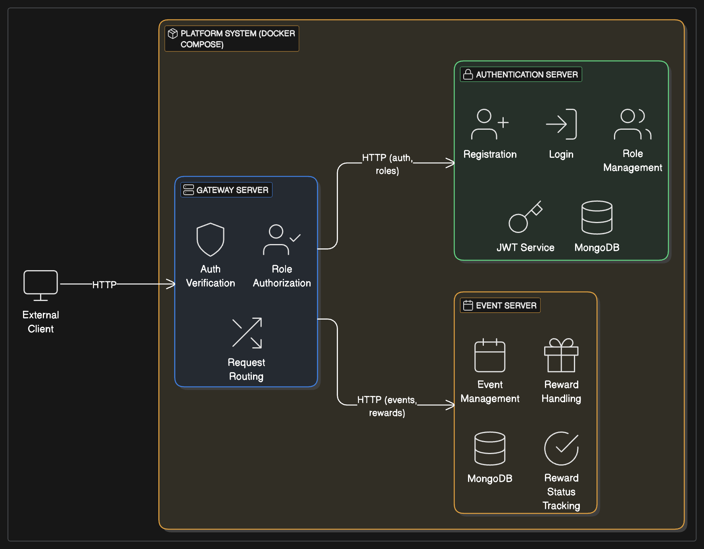

# 이벤트/리워드 관리 플랫폼

[](https://nodejs.org/)
[](https://www.typescriptlang.org/)
[](https://nestjs.com/)
[](https://www.mongodb.com/)
[](https://www.docker.com/)
[](LICENSE)
[](https://www.npmjs.com/)

본 프로젝트는 제공된 PRD(Product Requirements Document)를 기반으로 구현된 이벤트/리워드 관리 플랫폼입니다. MSA(Microservice Architecture)를 채택하여 각 기능을 독립적인 서비스로 분리하고, 유연성과 확장성을 높이는 데 중점을 두었습니다.

## 🌟 프로젝트 소개 및 학습 여정

저는 원래 백엔드 개발을 Java Spring으로 해왔어서 이번 과제가 하나의 좋은 학습 기회이자 챌린지로 다가왔습니다. 비록 Typescript, NestJS는 처음이지만 백엔드 개발자의 주 역할인 "확장성 있는, 모듈러화 된, 엔터프라이즈 애플리케이션 개발"이라는 것은 변하지 않기 때문에 이 철학을 염두에 두면서 빠른 학습과 개발에 임했습니다. 

학습은 인프런의 "따라하며 배우는 NestJS"라는 강의를 들었고 NestJS 및 Mongoose 연결 과정에서 모르는 부분은 ChatGPT, 구글링과 StackOverflow를 통해 답을 얻었습니다. 

한가지 아쉬운 점은 마이크로 서비스 간의 통신에 RabbitMQ를 적용하여 서버 간 통신을 NestJS의 철학에 맞게 비동기적으로 처리 하고 싶었는데, shared-lib를 만들고 시도는 해봤지만 아직 NestJS에 익숙하지 않아 잘 작동이 되지 않았고, 현재는 각 서비스 간 직접 HTTP 호출을 사용하는 방식으로 구현했습니다.

이벤트 리워드 시스템은 확장성이 높은 서비스이기 때문에 서비스간 연결 방식을 RabbitMQ을 사용하여 choreography-based 사가 패턴으로 전환하고 Transactional Outbox와 idempotent consumer 패턴으로 정합성을 강화하면 안정적으로 비동기 연결을 구현할 수 있을것 같습니다. 

## 🌟 설계

본 플랫폼은 확장성과 유지보수성을 최우선으로 고려하여 마이크로서비스 아키텍처(MSA) 기반으로 설계되었습니다.

*   **독립적인 기능 단위 (Bounded Context)**: 각 서비스는 명확히 정의된 독립적인 기능(인증, 이벤트 관리 등)을 수행합니다. 이는 각 서비스가 특정 도메인에 집중하고, 다른 서비스와의 결합도를 최소화하여 변경과 확장에 용이하도록 합니다.
    *   `auth-server`: 사용자 인증(JWT 발급), 권한 부여, 사용자 정보 관리 등 인증 및 인가와 관련된 모든 책임을 담당합니다.
    *   `event-server`: 이벤트 생성, 조건 설정, 상태 관리, 리워드 정의, 사용자의 리워드 요청 처리 등 이벤트 사이클 전반을 관리합니다. 향후 조건 검증 및 리워드 지급 로직은 외부 특화 서비스와 연동될 수 있도록 확장성을 고려하여 설계되었습니다.
    *   `gateway-server`: 모든 클라이언트 요청의 단일 진입점(Single Point of Entry) 역할을 하며, 요청 라우팅, 초기 인증 검증, 그리고 각 마이크로서비스로 사용자 식별 정보(예: `x-user-payload`)를 안전하게 전달하는 책임을 가집니다.

## 🛠️ 사용 기술

*   **Backend**: NestJS (Node.js 18), TypeScript
*   **Database**: MongoDB
*   **Authentication**: JWT (JSON Web Tokens) using RSA (RS256) with Public/Private Key Pair
*   **API Gateway**: `@nestjs/axios` 기반 프록시
*   **Containerization**: Docker, Docker Compose
*   **Package Manager**: npm

## 서비스 간 통신 및 주요 흐름



1.  **요청 진입**: 클라이언트의 모든 요청은 `gateway-server` (Port 3000)를 통해 시스템에 진입합니다.
2.  **게이트웨이 처리 및 라우팅**:
    *   `gateway-server`는 JWT 기반의 초기 인증을 수행합니다.
    *   요청 경로(예: `/auth/*`, `/events/*`)를 분석하여 해당 요청을 처리할 내부 마이크로서비스(`auth-server` 또는 `event-server`)로 안전하게 프록시합니다.
    *   이때, 인증된 사용자의 정보(페이로드)와 고유 요청 ID를 HTTP 헤더(예: `x-user-payload`, `x-request-id`)에 담아 전달함으로써, 내부 서비스들이 추가적인 사용자 조회 없이 컨텍스트를 인지하고 비즈니스 로직을 처리할 수 있도록 합니다.
3.  **내부 서비스 처리**:
    *   `auth-server` (Port 3001): 사용자 인증(로그인/등록), 토큰 재발급, 사용자 프로필 관리 등의 요청을 처리하고 `auth_db`와 통신합니다. JWT 토큰은 비대칭키(Private Key)를 사용하여 서명합니다.
    *   `event-server` (Port 3002): 이벤트, 리워드, 리워드 요청 관련 CRUD 및 상태 변경 등의 로직을 수행하며 `event_db`와 통신합니다. 수신된 JWT는 Public Key를 사용하여 검증합니다.
4.  **JWT 공개키 관리의 중요성 (Public Key Management for JWT)**: `auth-server`에서 Private Key로 서명한 JWT 토큰을 `gateway-server` 및 `event-server`가 올바르게 검증하기 위해서는, 이들 검증 서비스에 `auth-server`의 Public Key가 올바르게 설정되어 있어야 합니다. 또한, 동일한 `JWT_ALGORITHM` (예: `RS256`) 환경 변수를 공유해야 합니다. 이는 보안의 핵심 요소이며, 실제 운영 환경에서는 환경변수 관리 시스템, Vault, 또는 파일 마운트 등을 통해 안전하게 관리되어야 합니다. 키가 변경될 경우 모든 관련 서비스에 새로운 공개키가 배포되어야 합니다.

## 👥 사용자 역할 및 권한

| 역할 (Role) | 권한 (Permissions) |
|---|---|
| USER | 리워드 요청, 개인 리워드 내역 조회 |
| OPERATOR | 이벤트 생성/편집, 리워드 정의 |
| AUDITOR | 리워드 지급 내역 조회 (읽기 전용) |
| ADMIN | 모든 시스템 기능에 대한 전체 접근 권한 |

## 📋 주요 기능 요구사항

본 플랫폼은 다음 세 가지 주요 마이크로서비스로 구성됩니다.

### 1. 게이트웨이 서버 (Gateway Server)
- 모든 API 요청의 진입점 역할.
- JWT 토큰 기반 인증 검증.
- 역할 기반 접근 제어 (RBAC) 관리.
- 적절한 내부 서비스로 요청 라우팅.

### 2. 인증 서버 (Authentication Server)
- 사용자 회원가입 및 로그인 처리.
- 사용자 역할 관리 (USER, OPERATOR, AUDITOR, ADMIN).
- JWT 토큰 발급 (사용자 ID, 역할 정보 포함) 및 재발급.

### 3. 이벤트 서버 (Event Server)
- 이벤트 생성, 조회, 수정, 상태 변경 (활성/비활성).
- 이벤트와 연관된 리워드 정의 (포인트, 아이템, 쿠폰 등).
- 사용자 리워드 요청 처리:
    - 이벤트 조건 충족 여부 자동 검증.
    - 중복 리워드 요청 방지.
    - 요청 상태 추적 (대기, 승인, 거절).
- 승인된 리워드 지급 처리.
- 사용자별 요청 내역 및 전체 요청/지급 현황 리포팅.

## 💾 데이터 모델

<details>
<summary>데이터 모델 상세 보기 (클릭하여 확장)</summary>

### 사용자 (User)

```typescript
interface User {
  _id: ObjectId; // MongoDB 고유 ID
  username: string; // 사용자명 (고유)
  password: string; // 해시된 비밀번호
  email: string;    // 이메일 (고유)
  role: 'USER' | 'OPERATOR' | 'AUDITOR' | 'ADMIN'; // 사용자 역할
  createdAt: Date;  // 생성일시
  updatedAt: Date;  // 수정일시
}
```

### 이벤트 (Event)

```typescript
interface Event {
  _id: ObjectId;
  name: string;              // 이벤트명
  description: string;       // 이벤트 설명
  startDate: Date;           // 시작일시
  endDate: Date;             // 종료일시
  conditions: {              // 이벤트 완료 조건 배열
    type: string;            // 조건 유형 (예: "LOGIN_STREAK", "FRIEND_INVITE")
    target: number;          // 목표치 (예: 7일, 3명)
    details?: any;           // 조건별 추가 정보
  }[];
  status: 'ACTIVE' | 'INACTIVE'; // 이벤트 상태
  createdBy: ObjectId;         // 생성자 (User 참조)
  createdAt: Date;
  updatedAt: Date;
}
```

### 리워드 (Reward)

```typescript
interface Reward {
  _id: ObjectId;
  eventId: ObjectId; // 연관된 이벤트 (Event 참조)
  type: 'POINTS' | 'ITEM' | 'COUPON'; // 리워드 유형
  name: string;        // 리워드명 (예: "100 포인트", "전설 무기 스킨")
  description: string; // 리워드 설명
  quantity: number;    // 수량 (포인트 액수, 아이템 개수 등)
  createdAt: Date;
  updatedAt: Date;
}
```

### 리워드 요청 (RewardRequest)

```typescript
interface RewardRequest {
  _id: ObjectId;
  userId: ObjectId;     // 요청 사용자 (User 참조)
  eventId: ObjectId;    // 관련 이벤트 (Event 참조)
  rewardId: ObjectId;   // 요청한 리워드 (Reward 참조)
  status: 'PENDING' | 'APPROVED' | 'REJECTED'; // 요청 상태
  requestDate: Date;    // 요청일시
  processDate?: Date;   // 처리일시 (승인/거절 시)
  processedBy?: ObjectId; // 처리자 (User 참조, 수동 처리 시)
  notes?: string;       // 비고 (거절 사유 등)
}
```

</details>

## API 엔드포인트

<details>
<summary>API 엔드포인트 상세 보기 (클릭하여 확장)</summary>

### 인증 서버 (Auth Server - `/auth`)

*   `POST /register`: 신규 사용자 등록
*   `POST /login`: 사용자 로그인, JWT 반환
*   `GET /profile`: 현재 사용자 프로필 조회 (인증 필요)
*   `PUT /profile`: 사용자 프로필 수정 (인증 필요)

#### 역할 관리 (관리자 전용 - ADMIN)
*   `GET /users`: 모든 사용자 목록 조회
*   `GET /users/:id`: 특정 사용자 정보 조회
*   `PUT /users/:id/role`: 사용자 역할 수정

### 이벤트 서버 (Event Server)

#### 이벤트 (Events - `/events`)
*   `POST /`: 신규 이벤트 생성 (OPERATOR, ADMIN)
*   `GET /`: 모든 이벤트 목록 조회 (페이지네이션, 필터링 지원)
*   `GET /:id`: 특정 이벤트 상세 정보 조회
*   `PUT /:id`: 이벤트 정보 수정 (OPERATOR, ADMIN)
*   `PATCH /:id/status`: 이벤트 상태 변경 (OPERATOR, ADMIN)

#### 리워드 (Rewards - 주로 `/events/:eventId/rewards` 또는 `/rewards`)
*   `POST /events/:eventId/rewards`: 특정 이벤트에 대한 리워드 생성 (OPERATOR, ADMIN)
*   `GET /events/:eventId/rewards`: 특정 이벤트의 모든 리워드 목록 조회
*   `GET /rewards/:id`: 특정 리워드 상세 정보 조회
*   `PUT /rewards/:id`: 리워드 정보 수정 (OPERATOR, ADMIN)
*   `DELETE /rewards/:id`: 리워드 삭제 (OPERATOR, ADMIN)

#### 리워드 요청 (Reward Requests - `/requests`)
*   `POST /events/:eventId/request`: 특정 이벤트에 대한 리워드 요청 (USER 인증 필요)
*   `GET /me`: 자신의 리워드 요청 목록 조회 (USER 인증 필요)
*   `GET /`: 모든 리워드 요청 목록 조회 (OPERATOR, AUDITOR, ADMIN)
*   `GET /:id`: 특정 리워드 요청 상세 정보 조회
*   `PATCH /:id/status`: 리워드 요청 상태 변경 (OPERATOR, ADMIN)

</details>

## 🚀 시작하기

### 사전 준비물

*   Docker & Docker Compose
*   Node.js (v18)
*   NestJS CLI (`npm i -g @nestjs/cli`)
*   OpenSSL (RSA 키 쌍 생성용)

### RSA 키 쌍 생성

1.  프로젝트 루트 또는 안전한 위치에서 다음 명령어를 실행하여 Private Key와 Public Key를 생성합니다:
    ```bash
    openssl genpkey -algorithm RSA -out private_key.pem -pkeyopt rsa_keygen_bits:2048
    openssl rsa -pubout -in private_key.pem -out public_key.pem
    ```
2.  생성된 `private_key.pem`과 `public_key.pem` 파일의 내용을 환경변수(`JWT_PRIVATE_KEY`, `JWT_PUBLIC_KEY`)로 설정합니다.

### 전체 서비스 실행 (Docker Compose)

1.  `docker-compose.yml` 파일 내의 `JWT_PRIVATE_KEY` 및 `JWT_PUBLIC_KEY` 환경 변수 값을 실제 생성한 키 내용으로 업데이트합니다.
2.  프로젝트 루트 디렉토리에서 다음 명령어를 실행합니다:
    ```bash
    docker-compose up -d --build
    ```
2.  서비스 접근 주소:
    *   API Gateway: `http://localhost:3000`
    *   (직접 접근) Auth Server: `http://localhost:3001`, Event Server: `http://localhost:3002`
    *   (직접 접근) MongoDB (Auth): `mongodb://localhost:27018/auth_db`
    *   (직접 접근) MongoDB (Event): `mongodb://localhost:27019/event_db`


## ✨ API 엔드포인트 예시 (게이트웨이 경유)

모든 API는 게이트웨이(`http://localhost:3000`)를 통해 접근합니다.

*   **인증**: `POST /auth/register`, `POST /auth/login`, `GET /auth/profile` (인증 필요)
*   **이벤트**: `POST /events` (운영자 권한 필요), `GET /events`, `GET /events/{eventId}`
*   **리워드 요청**: `POST /events/{eventId}/request` (사용자 권한 필요), `GET /requests/me` (사용자 권한 필요)

## 🌱 향후 개선 방향

*   **테스트**: 단위, 통합, E2E 테스트 커버리지 확보 및 CI/CD 파이프라인 연동
*   **MSA 통신 안정화**: 서비스 간 비동기 통신(메시지 큐) 도입 고려
*   **중앙 집중 로깅 및 모니터링**: ELK 스택 또는 Prometheus/Grafana를 활용한 통합 모니터링 환경 구축.
*   **보안 심층 강화**: API 요청 속도 제한, 웹 방화벽(WAF) 도입 등